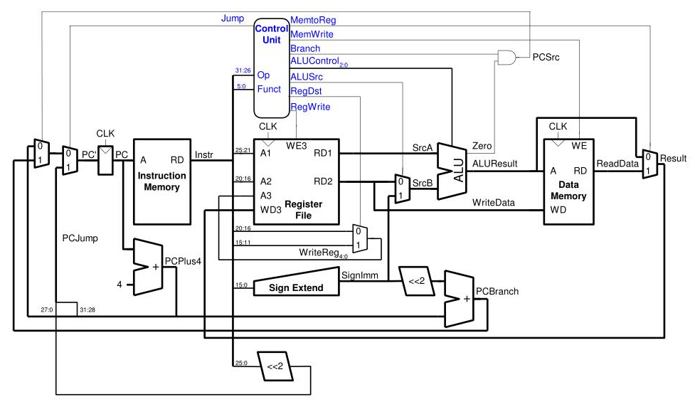

# Instruction Set Architecture
ISA (Instruction Set Architecture) for MIPS 32 refers to the set of instructions that the MIPS (Microprocessor without Interlocked Pipeline Stages) architecture supports for 32-bit processing.

- **Instruction Formats**: MIPS 32 instructions are typically 32 bits long and can be categorized into three main formats: R-type, I-type, and J-type. R-type instructions are used for arithmetic and logical operations, I-type instructions for immediate values "adding constant to register", and J-type instructions for jump operations.

- **Registers**: MIPS 32 architecture has 32 general-purpose registers, labeled as $0 to $31. Register $0 is hardwired to zero and has special properties.

- **Data Types**: MIPS 32 supports 32-bit data types for integers, but not supporing floating-point numbers.

## Microprocessor without Interlocked Pipeline Stages
 
<table>
  <tr>
    <td style="text-align: center;">
        
      
-Top level schematic for mips.

    </td>
    <td style="text-align: center;">
        
      
- Detailed schematic for mips.

    </td>
  </tr>
</table>

## Objective

- Set of predefined MIPS instructions.
- Design a simplified MIPS processor in Verilog.
- Develop a testbench plan to verify the functionality and performance of the processor.

## Tools and Technologies
- **Hardware Description Language (HDL)** : Verilog
- **Simulation and Verification** : QuestaSim
- **Synthesis Tool** : Vivado
-  **Hardware** : FPGA xilinx spartan 6 board

## Project Phases
1. Requirements Analysis
2. Design Specification
3. Implementation
4. Testbench Design
5. Verification  

## Phase 1: Requirements Analysis
- **Task 1.1** : Identify the subset of MIPS instructions to be implemented (ADD, SUB, LW, SW, .. ).
- **Task 1.2** : Determine the required processor components (ALU, Register File, Control Unit, .. ).
- **Task 1.3** : Establish performance goals and constraints (clock speed , timing constraints, ..).

## Phase 2: Design Specification
- **Task 2.1** : Define the architecture of the MIPS processor, including the datapath and control path.
- **Task 2.2** : Create detailed specifications for each processor component.
- **Task 2.3** : Design the instruction set architecture (ISA) and encoding scheme.

## Phase 3: Implementation
- **Task 3.1** : Implement the processor components in Verilog (ALU, Register File, .. ).
- **Task 3.2** : Develop the control unit.
- **Task 3.3** : Integrate the components to form the complete MIPS processor.

##  Phase 4: Testbench Design
- **Task 4.1** : Develop a test plan outlining the tests to be performed, including unit tests for components and integration tests for the full processor.
- **Task 4.2** : Write testbench code in Verilog to implement the test plan.
- **Task 4.3** : Create test vectors and stimulus for each test case.

##  Phase 5: Verification
- **Task 5.1** : Simulate the individual components using the testbench code.
- **Task 5.2** : Perform integration testing on the full processor.
- **Task 5.3** : Analyze the simulation results and verify against the specifications.

## References 
- Digital Logic And Computer Design By M. **Morris Mano**
- Computer Organization and Design RISC-V edition written by **David A. Patterson** and **John L. Hennessy**
- Digital Design and Computer Architecture Book by **David Harris**

